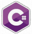
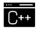

# Hi, I'm Vagner Bellacosa, a renegade IBM Mainframe Jedi knight, I fought in the Y2K War, participated in the final battles of the EURO conversion and fought the good fight in SEPA.
## I was one of those massacred in the TRAG Sem TRAG Multi-Cartridge Project, implementing the software after much pain and struggle.
### :D 🤪 🤪 🤪 😮‍💨 😵

[](https://github.com/VagnerBellacosa)
[](https://www.linkedin.com/in/vagnerbellacosa/)
[](https://twitter.com/BellacosaVagner)
[](https://www.youtube.com/user/vagnerbellacosa)
[](https://stackoverflow.com/users/16342776/vagner-bellacosa)
<a href="https://api.whatsapp.com/send?phone=5519983190111&" alt="WhatsApp">
</a>
<a href="https://www.instagram.com/vagnerbellacosa/" alt="Instagram">
</a>


### About me
I dinosaur in programming, I started my trail by force in the 80's of the last century. I programmed in 8 bits, mainframe, 16 bits, aix and now I'm an apprentice in 64.
Great powers great responsibilities. I am a Noob

- [Courses](https://digitalinnovation.one/sign-up?ref=R5J3ZLTIFS) 👨🏼‍🏫 - Academy for renegade Jedis and computer apprentices, come be a padawan
- [Blog](https://andarilhovisitaportugal.blogspot.com/) ✍🏼 - I'm write about many things.
- [Website](https://eljefemidnightlunch.blogspot.com/) 💻 - Working on it.

## Jedi Powers
  Mainframe Systems Analyst,    Procedural Logic,   JAD,  Agile,  Scrum... 

### Weapons 
 PLI,   COBOL,  Software AG Natural,    Clipper,    Visual Basic,   C#,  Javascript,  JAVA,   CICS,    Basic,  MS VBA ...

#### Armory 
 CA Endevor,  Changeman ZMF,   GitHub,  Apache Subversion,  CVS

## Weapons First Order
 VSAM,   Adabas,   DB2,    MS SQL,   MySQL...

## Galactic Cruiser 
 OS 360,     Z/OS,    MS DOS,   Windows,    AIX,  

  AS 400 ,   Linux ...

### Galactic Aircraft carrier

  TSO,    Roscoe,    AWS ...

### Galactic Frigate 

    JCL,     Shell Script,    AutoExec Batch,    QMF,   Spufi ...

### Galactic Corvette 

  MS Office,    MS Project,   MS Visio,   Animaker,   Canva,   Figma ...

#### Solar Ships
   Eclipse,    Genexus,     Visual Studio,    VS Code

##### Planet Ships
 Html ,  CSS,  PHP 

## Renegade ongoing trainings
   Python,    Azure,    Kotlin,      Ajax,    Oracle,    C++,

 .Net,    Bootstrap,   Node.Js,  React.Jsp,     Angular  

and more...


📰  📰  📰 NEW 📯  📯  📯

<div>
    <a href="https://twitter.com/BellacosaVagner" target="blank">
    
  </a>
 
</div>

<br>
<br>

<center>

| | | |
| :---: |  :---: |  :---: |
|  &nbsp; &nbsp; &nbsp; &nbsp; &nbsp; |  [](https://hits.seeyoufarm.com) |  &nbsp; &nbsp; &nbsp; &nbsp; &nbsp; | 

 ##### Heart of Gold spaceship
| | | |
| :---: |  :---: |  :---: |
|  &nbsp; &nbsp; &nbsp; &nbsp; &nbsp; |  |  &nbsp; &nbsp; &nbsp; &nbsp; &nbsp; |

##### Armory weapons stat
| | | |
| :---: |  :---: |  :---: |
|  &nbsp; &nbsp; &nbsp; &nbsp; &nbsp; |  |  &nbsp; &nbsp; &nbsp; &nbsp; &nbsp; |

##### Slartibartfast Spy and design
| |  | |
| :---: |  :---: |  :---: |
|  &nbsp; &nbsp; &nbsp; &nbsp; &nbsp; |  |  &nbsp; &nbsp; &nbsp; &nbsp; &nbsp; |

##### Vogons on my repository View Counter
| |  | |
| :---: |  :---: |  :---: |
|  &nbsp; &nbsp; &nbsp; &nbsp; &nbsp; |  |  &nbsp; &nbsp; &nbsp; &nbsp; &nbsp; |

| | | **Galactic Sonar** | | |
| :---: | :---: | :---: | :---: |  :---: |
| &nbsp; &nbsp; &nbsp; &nbsp; &nbsp; |  [](https://GitHub.com/VagnerBellacosa/StrapDown.js/watchers/)  |       |  [](https://github.com/VagnerBellacosa?tab=followers)   | [Spies](https://profile-counter.glitch.me/VagnerBellacosa/count.svg) |
| | | | | |

| | | **Lighthouse At The End Of The World**  | | |
| :---: | :---: | :---: | :---: | :---: |
| &nbsp; &nbsp; &nbsp; &nbsp; &nbsp; | <a href="mailto:vagnerbellacosa@gmail.com?"></a> |   [](https://GitHub.com/VagnerBellacosa/ama)   |    [](http://commonmark.org)    | &nbsp; &nbsp; &nbsp; &nbsp; &nbsp; |
| | | | | |

| | **My Jedi Condemnations in Missions** | | 
| :---: | :---: | :---: |
| &nbsp; &nbsp; &nbsp; &nbsp; &nbsp; | [](https://github.com/ryo-ma/github-profile-trophy) | &nbsp; &nbsp; &nbsp; &nbsp; &nbsp; |
| | | |

| | **My Sidereal Activities**    | |
| :---: | :---: | :---: |
| &nbsp; &nbsp; &nbsp; &nbsp; &nbsp; | [](https://github.com/DenverCoder1/github-readme-streak-stats) | &nbsp; &nbsp; &nbsp; &nbsp; &nbsp; |
| | | |

| | **My Wakatime**    | |
| :---: | :---: | :---: |
| &nbsp; &nbsp; &nbsp; &nbsp; &nbsp; |   | &nbsp; &nbsp; &nbsp; &nbsp; &nbsp; | 
| | | |

</center>

```Work
Work in progress
Work in constant evolution, visit us often!
```


| | **Badges** | |
| :---: | :---: | :---: |
| &nbsp; &nbsp; &nbsp; &nbsp; &nbsp; | [](https://www.apiseven.com/en/contributor-graph?chart=contributorOverTime&repo=VagnerBellacosa/badges)               | &nbsp; &nbsp; &nbsp; &nbsp; &nbsp; |
| | | |
